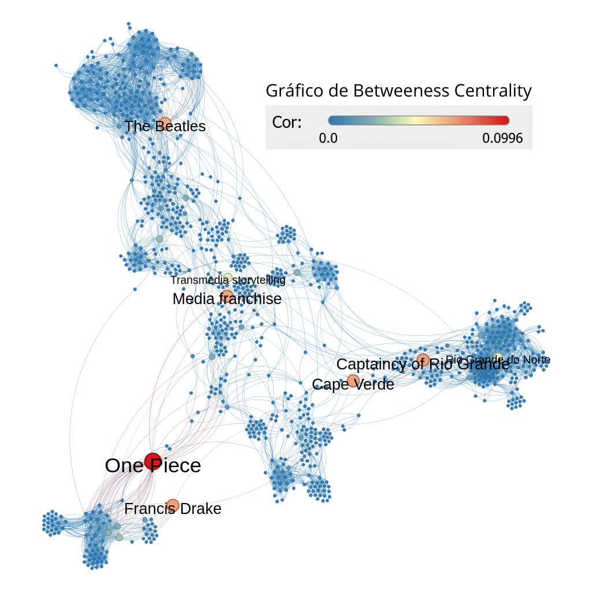
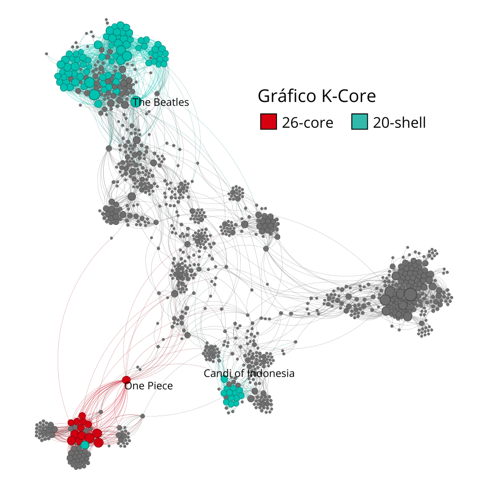
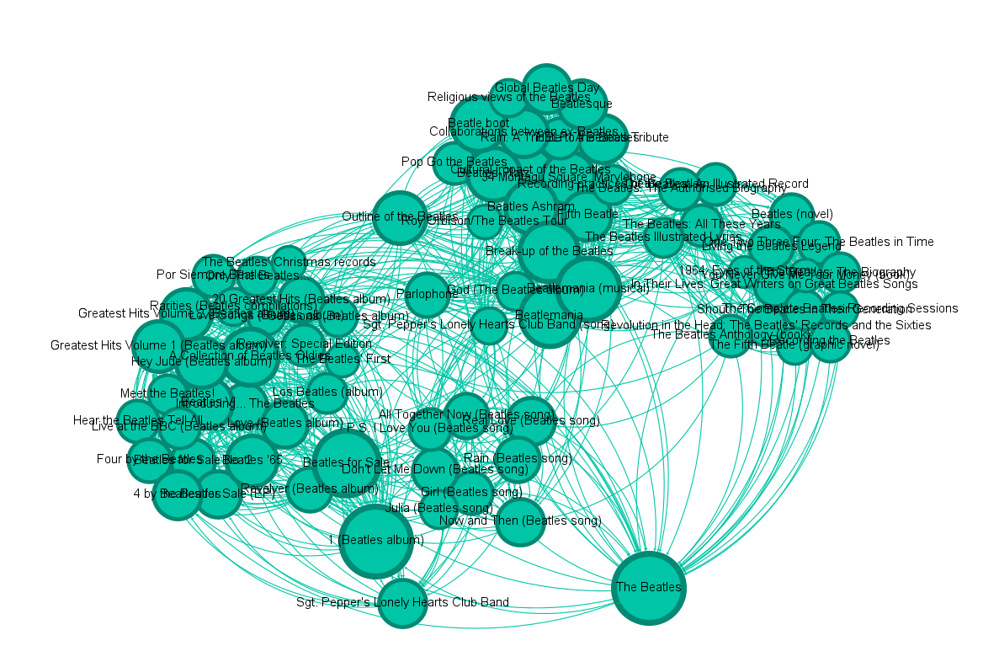
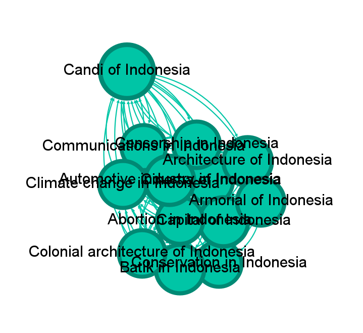

# Análise de Redes Complexas: A Teia da Wikipédia

## Apresentação do Projeto
> **[INSIRA AQUI O LINK PARA O VÍDEO NO YOUTUBE/LOOM]**

---

## Descrição do Projeto

Este trabalho final da disciplina de **Estrutura de Dados II** tem como objetivo construir, visualizar e analisar uma rede complexa baseada em páginas da Wikipédia. Utilizando conceitos de Teoria dos Grafos, exploramos como tópicos aparentemente distintos se conectam através de hiperlinks.

A rede foi gerada a partir da fusão de dados de **5 Seeds (Sementes)** de domínios variados, explorando conexões até o **Nível 2 (Altura < 3)**. Devido ao crescimento exponencial da rede nesta profundidade, foi implementada uma **heurística de otimização** para viabilizar a coleta de dados e manter a coesão temática.

### Seeds Utilizados
1. **Transformer (Deep Learning)** - Tecnologia
2. **The Beatles** - Música/Cultura Pop
3. **Revolução Francesa** - História
4. **One Piece** - Entretenimento
5. **Rio Grande do Norte** - Geografia

---

## Objetivos

O projeto visa responder, visualmente e metricamente, às seguintes questões de análise de redes:

* **Centralidade:** Quais são as páginas mais influentes da rede? (Degree, Closeness ou Betweenness ou Eigenvector Centrality).
* **Topologia:** Como a rede se estrutura em termos de camadas (K-Core e K-Shell)?
* **Comunidades:** Existem grupos de páginas que formam "bolhas" de conteúdo distintas?
* **Desafio Computacional:** Como coletar uma rede massiva (Nível 2) de forma eficiente utilizando uma estrutura de dados e uma heurística ?

---

## Metodologia e Solução com uma heurística e Estrutura de Dados

A coleta de dados seguiu um pipeline rigoroso para garantir a relevância e viabilidade técnica, conforme exigido pelo **Requisito 4** do trabalho.

### 1. Coleta Inteligente (Heurística e Priority Queue)
A abordagem tradicional de busca em largura (BFS) inviabilizaria a coleta até a altura < 3 devido à explosão combinatória de links. Para resolver isso, implementamos uma **Busca Baseada em Heurística**:

* **Estrutura de Dados:** Substituímos a fila comum por uma **Fila de Prioridade (Min-Heap)** usando a biblioteca `heapq`.
* **Heurística de Score:** Cada link recebe uma pontuação inicial que é ajustada dinamicamente:
    * **Bonificação (-50 pts):** Links que contêm palavras-chave dos Seeds (ex: "Brasil", "Revolução", "Beatles") ganham alta prioridade (furam a fila).
    * **Penalidade (+20 pts):** Títulos excessivamente longos (>40 caracteres) ou irrelevantes recebem baixa prioridade.
* **Resultado:** O algoritmo prioriza a expansão de nós semanticamente relevantes, garantindo uma base de dados rica mesmo sob limitações computacionais.

### 2. Tratamento dos Dados
* **Limpeza:** Remoção de *Self-Loops* e fusão de nós duplicados (ex: Plurais e variações com hífen).
* **Filtragem (Core):** Aplicação de um filtro para manter apenas nós com **Grau ≥ 2**, eliminando páginas isoladas e reduzindo o ruído visual.

---

## Resultados e Visualizações

### 1. Métricas de Centralidade
Nesta visualização, o tamanho dos nós é proporcional ao **Grau (Degree)**, indicando a quantidade de conexões diretas; as cores representam o **Betweenness Centrality** (Intermediação).



* **Hubs Locais (Nós Grandes e Azuis):** Vértices como **"Rio Grande do Norte"** e **"The Beatles"** possuem alto *Degree* (são muito grandes), mas baixo *Betweenness* (são azuis). Isso indica que são hubs de comunidades fechadas: eles conectam muitos artigos dentro do seu próprio tema, mas não servem como caminho para outros assuntos.
* **Pontes Globais (Nós Vermelhos/Laranjas):** O nó **"Media franchise"** e **"One Piece"** aparecem com cores quentes. O destaque para "Media franchise" sugere que ele atua como uma ponte semântica, conectando o cluster de anime/mangá (One Piece) a outros conceitos de entretenimento na rede, sendo vital para o fluxo de informação entre clusters distintos.

### 2. Decomposição K-Core e K-Shell
Para entender a hierarquia da rede, aplicamos a decomposição K-Core. Esta análise filtra a rede em "camadas", onde o **K-Core** (vermelho) representa o núcleo máximo de densidade e o **K-Shell** (verde-azulado) representa camadas periféricas de alta conexão.



* **O Núcleo Duro (26-Core):** O núcleo máximo da rede (em vermelho) é composto inteiramente pelo cluster de **"One Piece"**. Isso revela que os artigos sobre animes/mangás na Wikipédia tendem a ser extremamente interconectados (personagens linkam episódios, que linkam jogos, etc.), formando a clique mais densa da coleta.
* **A Periferia Densa (20-Shell):** Embora não façam parte do núcleo máximo, os clusters de **"The Beatles"** e **"Indonésia"** sobreviveram até camadas profundas (Shell 20), indicando que também possuem alta coesão interna.

#### Detalhes dos Shells (Zooms)

Para melhor visualizar a densidade local, destacamos dois grupos que formam o **20-Shell**:

| Cluster: The Beatles (20-Shell) | Cluster: Indonésia (20-Shell) |
| :---: | :---: |
|  | 
| *Alta interconexão entre álbuns, músicas e biografia dos integrantes.* | *Clique denso focado em cultura, arquitetura ("Candi") e sociedade indonésia.* |

### 3. Detecção de Comunidades (Modularidade)
O algoritmo de Modularidade identificou grupos temáticos distintos, representados pelas cores. Mesmo em uma rede densa, é possível ver a separação clara dos assuntos das Seeds.


* **Verde:** Corresponde ao ecossistema dos Beatles. É uma comunidade bem isolada, conectando-se pouco com os outros clusters de cultura pop. Exemplos: The Beatles, John Lennon
* **Rosa:** O cluster de One Piece e animes. Exemplos: One Piece, personagens de One Piece
* **Roxo:** O cluster de Rio Grande do Norte e história do Brasil, se conectando também com o cluster azul e o cinza, que são ligados a assuntos históricos. Exemplos: Rio Grande do Norte, Coronelismo
* **Laranja e Marrom Claro:** Tópicos mistos de cultura pop. Exemplos: Ariana Grande, BBC One
* **Marrom Escuro:** Tópicos conectados com anime e cultura pop. Exemplos: Anime, DC Comics
* **Ciano:** Cluster ligado à França e à mídia francesa. Exemplos: França, Euronews
* **Azul:** Ligado à Revolução Francesa e história mundial. Exemplos: Revolução Francesa, Indonesia
* **Cinza:** Ligado a história e geografia mais relacionadas às américas. Exemplos: Capitania de São Vicente, Guerra Civil Americana, etc.  

---

## Como Executar o Projeto no Google Colab

Para replicar a coleta e análise:

1.  **Clone o repositório:**
    ```bash
    git clone [https://github.com/seu-usuario/seu-repositorio.git](https://github.com/seu-usuario/seu-repositorio.git)
    cd seu-repositorio
    ```

2.  **Abra o Notebook:**
    * Faça o upload do arquivo `.ipynb` para o [Google Colab](https://colab.research.google.com/). Nota: é necessário instalar as dependências (NetworkX, Wikipedia, etc.) no ambiente do Colab.

3.  **Execute as Células:**
    * Execute todas as células na sequência para reproduzir os resultados.

## Como Executar o Projeto Localmente

Este projeto utiliza **Poetry** para gerenciamento de dependências e um **Jupyter Notebook** para execução do código e visualização dos dados.

### Pré-requisitos
* Python instalado (versão compatível com o definido no `pyproject.toml`).
* [Poetry](https://python-poetry.org/docs/) instalado.

### Passo a Passo

Após clonar o repositório, siga os passos abaixo:
1.  **Instale as dependências:**
    Na raiz do projeto, execute o comando abaixo para criar o ambiente virtual e instalar as bibliotecas (NetworkX, Wikipedia, Jupyter, etc.):
    ```bash
    poetry install
    ```

2.  **Abra o Notebook:**
    Para iniciar o servidor do Jupyter e abrir o arquivo `.ipynb`:
    ```bash
    poetry run jupyter notebook
    ```
    Isso abrirá uma aba no seu navegador. Clique no arquivo **`main.ipynb`** para iniciar.

3.  **Execute a Coleta:**
    * No Jupyter, execute as células sequencialmente.

4.  **Visualize os Resultados:**
    Ao final da execução do notebook, será gerado o arquivo `trabalho_final_validacao.graphml`. Abra este arquivo no software **Gephi** para aplicar as métricas visuais e colorações finais.

## Tecnologias Utilizadas

* **Linguagem:** `Python 3`
* **Bibliotecas Principais:**
    * `Wikipedia`: Extração de dados.
    * `NetworkX`: Modelagem de grafos e algoritmos.
    * `Heapq`: Implementação de estruturas de dados eficientes.
* **Software:**
    * `Gephi`: Visualização e Análise.


> Este projeto foi desenvolvido por Alice Maria Fonseca Victorino Freire e Erick Vinicius Justino da Silva para a disciplina de Algoritmos e Estrutura de Dados II (DCA/UFRN).
