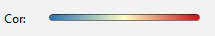
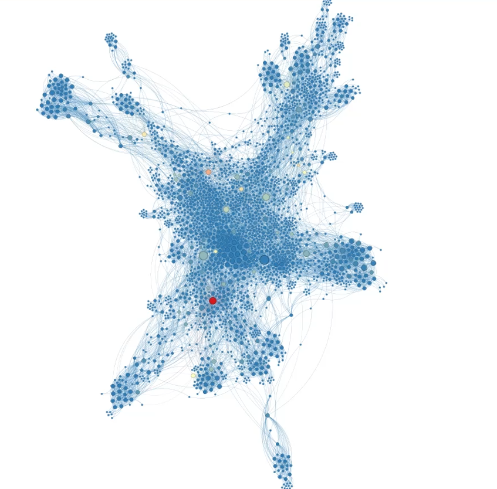
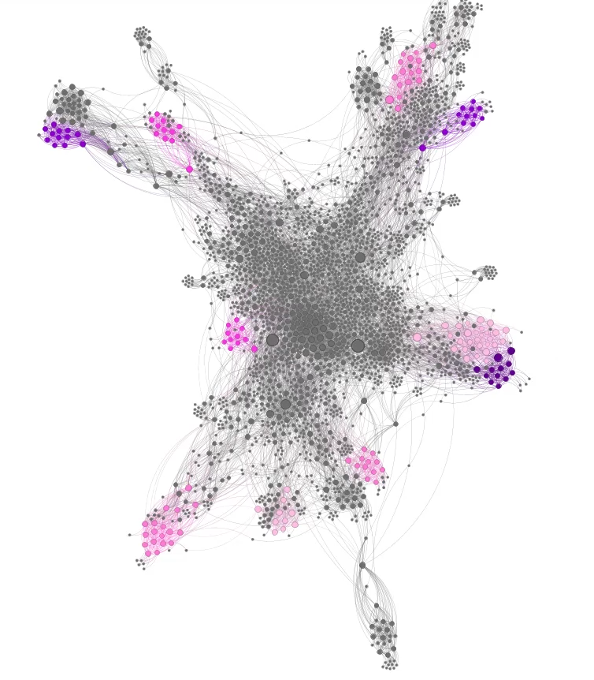
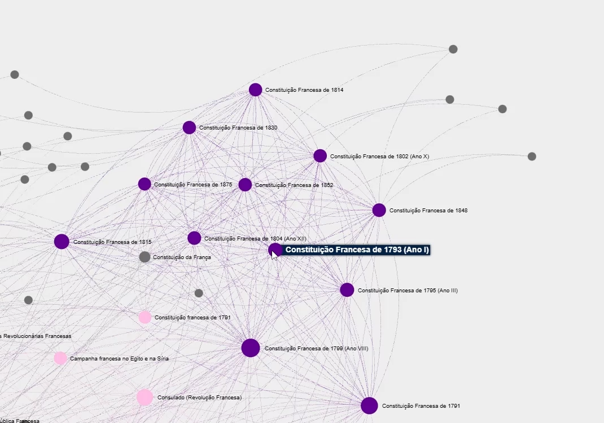

# Análise de Redes Complexas: A Teia da Wikipédia

## Apresentação do Projeto
> **[INSIRA AQUI O LINK PARA O VÍDEO NO YOUTUBE/LOOM]**

---

## Descrição do Projeto

Este trabalho final da disciplina de **Estrutura de Dados II** tem como objetivo construir, visualizar e analisar uma rede complexa baseada em páginas da Wikipédia. Utilizando conceitos de Teoria dos Grafos, exploramos como tópicos aparentemente distintos se conectam através de hiperlinks.

A rede foi gerada a partir da fusão de dados de **5 Seeds (Sementes)** de domínios variados, explorando conexões até o **Nível 2 (Altura < 3)**. Devido ao crescimento exponencial da rede nesta profundidade, foi implementada uma **heurística de otimização** para viabilizar a coleta de dados e manter a coesão temática.

### Seeds Utilizados
1. **Transformer (Deep Learning)** - Tecnologia
2. **The Beatles** - Música/Cultura Pop
3. **Revolução Francesa** - História
4. **One Piece** - Entretenimento
5. **Rio Grande do Norte** - Geografia

---

## Objetivos

O projeto visa responder, visualmente e metricamente, às seguintes questões de análise de redes:

* **Centralidade:** Quais são as páginas mais influentes da rede? (Degree, Closeness ou Betweenness ou Eigenvector Centrality).
* **Topologia:** Como a rede se estrutura em termos de camadas (K-Core e K-Shell)?
* **Comunidades:** Existem grupos de páginas que formam "bolhas" de conteúdo distintas?
* **Desafio Computacional:** Como coletar uma rede massiva (Nível 2) de forma eficiente utilizando uma estrutura de dados e uma heurística ?

---

## Metodologia e Solução com uma heurística e Estrutura de Dados
A coleta de dados seguiu um pipeline rigoroso para garantir a relevância e viabilidade técnica, conforme exigido pelo **Requisito 4** do trabalho.

### 1. Coleta Inteligente (Beam Search e Poda)
A abordagem tradicional de busca em largura (BFS) inviabilizaria a coleta até o **nível 2 (altura < 3)** devido à explosão combinatória de links. Para resolver isso e tornar a coleta possível, implementamos uma estratégia de **Busca em Feixe (*Beam Search*)**:

* **Estrutura de Dados:** Substituímos a fila comum por uma **Fila de Prioridade (Min-Heap)** usando a biblioteca `heapq`, permitindo o acesso imediato aos nós mais promissórios.
* **Heurística de Score:** Cada link recebe uma pontuação de relevância:
    * **Bonificação (-50 pts):** Links que contêm palavras-chave dos Seeds (ex: "Brasil", "Revolução", "Beatles") ganham prioridade máxima.
    * **Penalidade (+50 pts):** Títulos excessivamente longos (>50 caracteres) ou listas ("Lista de...") são penalizados.
* **Técnica de Poda (*Pruning*):**
    Para garantir a performance, aplicamos um limite rígido de **Top-20 Melhores Filhos** por página. O algoritmo avalia todos os links de uma página, mas adiciona à fila apenas os 20 com melhor pontuação (menor score).
* **Resultado:** Essa abordagem transformou o crescimento exponencial da rede em um crescimento linear controlado, gerando uma base de dados densa e semanticamente focada em poucos minutos.

### 2. Tratamento dos Dados
* **Limpeza:** Remoção de *Self-Loops* e fusão de nós duplicados (ex: Plurais e variações com hífen).
* **Filtragem (Core):** Aplicação de um filtro para manter apenas nós com **Grau ≥ 2**, eliminando páginas isoladas e reduzindo o ruído visual para a análise no Gephi.
---

## Resultados e Visualizações

### 1. Métricas de Centralidade
Nesta visualização, o tamanho dos nós é proporcional ao **Grau (Degree)**, indicando a quantidade de conexões diretas; as cores escolhidas foram relacionadas com o o **Betweenness Centrality**.

A escala de cores utilizada varia do azul (menor valor) ao vermelho (maior valor), destacando com tons mais quentes os nós que atuam como pontes cruciais na rede.




* O nó com maior valor de betweenness é a página **Rio Grande do Norte**, que também é uma das seeds.
* Outros nós importantes são: Brasil, Ariana Grande, Revolução Francesa, Língua Japonesa, Aprendizado de Máquina


### 2. Decomposição K-Core e K-Shell
Para entender a hierarquia da rede, aplicamos a decomposição K-Core. Esta análise filtra a rede em "camadas", onde o **K-Core** (roxo mais escuro) representa o núcleo máximo de densidade e o **K-Shell** representa camadas periféricas de alta conexão.



O k-core máximo encontrado foi **k=22**, então foram definidas 5 camadas de k-shells para enriquecer a visualização, começando do tom de rosa mais claro (k=18) até o roxo mais escuro (k=22).

O conteúdo do k-core inclui páginas referentes à constituição francesa, que são fortemente interconectadas, como pode ser visto a seguir.



### 3. Detecção de Comunidades (Modularidade)
O algoritmo de Modularidade identificou grupos temáticos distintos, representados por 8 cores. Mesmo em uma rede densa, é possível ver a separação clara dos assuntos das Seeds.


- Laranja: Cluster com páginas relacionadas ao Rio de Janeiro.
- Amarelo: Relacionados a rios, hidrografia.
- Vermelho: Páginas sobre história do Brasil, capitanias e brasões.
- Ciano: Relacionado à cidade de Campina Grande.
- Verde-água: Cluster relacionado à Revolução Francesa e história europeia e francesa.
- Amarelo: Módulo extremamente difuso, parece ser ligado a história geral e Américas.
- Rosa: Cluster ligado a One Piece, entretenimento e cultura japonesa.
- Verde: Relacionado a música, bandas e cultura pop, como Beatles e Ariana Grande.
- Azul: Cluster relacionado a tecnologia, aprendizado de máquina e inteligência artificial.
---

## Como Executar o Projeto no Google Colab

Para replicar a coleta e análise:

1.  **Clone o repositório:**
    ```bash
    git clone [https://github.com/seu-usuario/seu-repositorio.git](https://github.com/seu-usuario/seu-repositorio.git)
    cd seu-repositorio
    ```

2.  **Abra o Notebook:**
    * Faça o upload do arquivo `.ipynb` para o [Google Colab](https://colab.research.google.com/). Nota: é necessário instalar as dependências (NetworkX, Wikipedia, etc.) no ambiente do Colab.

3.  **Execute as Células:**
    * Execute todas as células na sequência para reproduzir os resultados.

## Como Executar o Projeto Localmente

Este projeto utiliza **Poetry** para gerenciamento de dependências e um **Jupyter Notebook** para execução do código e visualização dos dados.

### Pré-requisitos
* Python instalado (versão compatível com o definido no `pyproject.toml`).
* [Poetry](https://python-poetry.org/docs/) instalado.

### Passo a Passo

Após clonar o repositório, siga os passos abaixo:
1.  **Instale as dependências:**
    Na raiz do projeto, execute o comando abaixo para criar o ambiente virtual e instalar as bibliotecas (NetworkX, Wikipedia, Jupyter, etc.):
    ```bash
    poetry install
    ```

2.  **Abra o Notebook:**
    Para iniciar o servidor do Jupyter e abrir o arquivo `.ipynb`:
    ```bash
    poetry run jupyter notebook
    ```
    Isso abrirá uma aba no seu navegador. Clique no arquivo **`main.ipynb`** para iniciar.

3.  **Execute a Coleta:**
    * No Jupyter, execute as células sequencialmente.

4.  **Visualize os Resultados:**
    Ao final da execução do notebook, será gerado o arquivo `trabalho_final_validacao.graphml`. Abra este arquivo no software **Gephi** para aplicar as métricas visuais e colorações finais.

## Tecnologias Utilizadas

* **Linguagem:** `Python 3`
* **Bibliotecas Principais:**
    * `Wikipedia`: Extração de dados.
    * `NetworkX`: Modelagem de grafos e algoritmos.
    * `Heapq`: Implementação de estruturas de dados eficientes.
* **Software:**
    * `Gephi`: Visualização e Análise.


> Este projeto foi desenvolvido por Alice Maria Fonseca Victorino Freire e Erick Vinicius Justino da Silva para a disciplina de Algoritmos e Estrutura de Dados II (DCA/UFRN).
